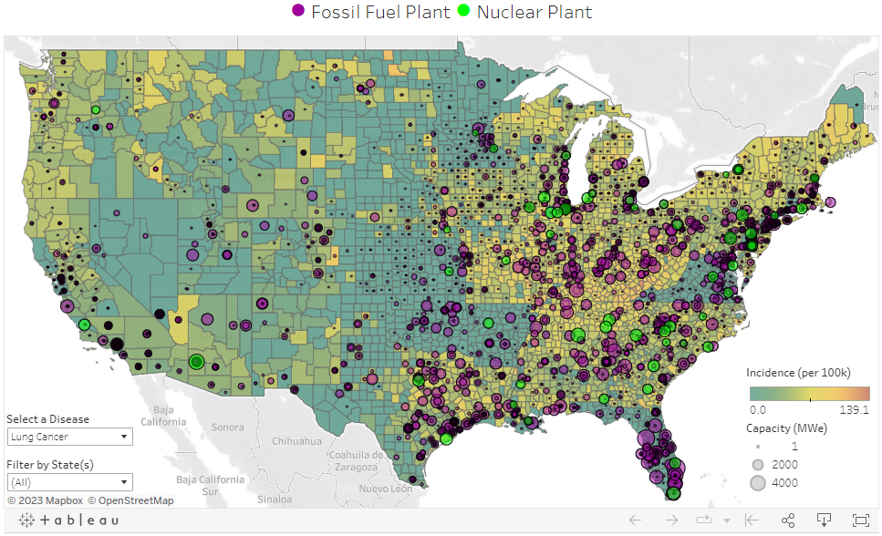
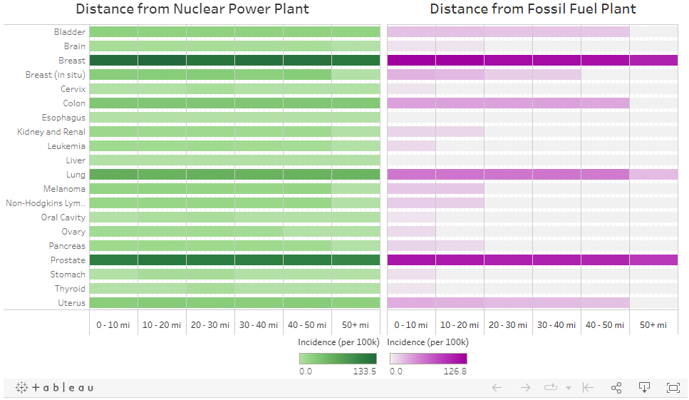
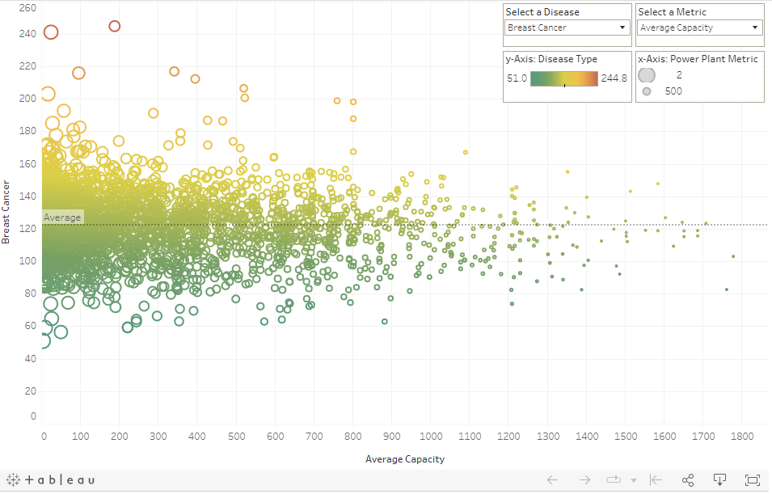

# SWAT Project: US and Global Health Metrics for Disease and Life Expectancy Predictions

Our Presentation

https://willmino.github.io/US_and_global_health_metrics/

Welcome to Team SWAT's final project!

- **S**ean Wood
- **W**ill Mino
- **A**fra Panahi
- **T**eo Anderson

## Communication Protocols

The main form of communication between group members takes place in a private Slack channel, with a pinned thread for active tasks. Additionally, there is a Google document containing minutes from each group meeting, including topics such as our divided responsibilities and upcoming tasks to be completed.

## Selected Topic and Reasoning for Selection 
Probing the Links Between Energy Sources, Pollution, and Socioeconomic Factors with Various Health Metrics

Nuclear energy is often feared by the public because of the potential health hazards of radiation. But are these fears warranted? Or are normal fossil fuel power plants more dangerous for our health? We plan to compare the two to see which one has a stronger correlation to a variety of diseases and cancers.

On a global scale, the required metrics are often not collected at a granular-enough scale to do a similar study, so instead we are going to see if we can develop a model that takes in commonly available worldwide data about countries and outputs the country's life expectancy.

## Questions the Group Originally Aimed to Answer with the Data
- **Question 1a**: Does the proximity of a nuclear power plant to a county in the United States increase the risks of cancer (e.g. thyroid) for the residents of that county?
- **Question 1b**: Do (1) the proximity of a pollution-emitting fossil fuel power plant to a county and (2) pollutant emissions (NOx, SOx, particulate matter, etc) correlate to rates of lung diseases, cardiovascular diseases, or cancers?
- **Question 2**: Can you predict a country’s life expectancy with various readily available factors such as GDP per capita, healthcare spending per capita, energy sources, pollution levels, poverty levels, obesity rates, etc?

## Description of the Data Sources
- Every county in the US and the coordinates of its geographic midpoint
- Every nuclear power plant currently operating in the US, their geographic coordinates, and their nameplate generation capacity
- Every fossil fuel (oil, gas, coal, biomass, other) power plant currently operating in the US, their geographic coordinates, their nameplate generation capacity, and their pollution emissions (NOx, SO2, CO2, CH4, N2O, PM2.5)
- Global dataset pollution data: various pollutions emissions such as co, so2, no2, no, o3, nh3, etc. Obtained from Openweathermap Historical Pollution API.
- Incidence rates of several types of cancers for each county in the US
- Incidence rates of various lung and cardiovascular diseases for each county in the US
- Life expectancy data for every country
- GDP per capita data for every country
- Healthcare spending per capita for every country
- Poverty rates for every country
- Obesity rates for every country
- Pollution levels / air quality indices in every country

Links to data sources can be found in [links.md](https://github.com/TeodorAnderson/SwatProject/blob/main/links.md)

## Description of the data exploration phase of the project
### Questions 1a and 1b
- Location data for every US county and the various nuclear and fossil fuel power plants were used to calculate the distances between each county and each power plant.
- Since there are so few nuclear power plants, only the closest plant was recorded, whereas for fossil fuel plants, the closest five plants were recorded.
- Other metrics were calculated for each power plant, including averaged pollutant values and pollutant values normalized by plant capacity.
- Target data (cancer per county, cardio death rate and respiratory diseases per county) were collected from NIH/CDC, CDC and American Lung Association
- FIPS county codes were used as a common primary key to combine the county-power plant data with the disease data to generate the dataset used in the machine learning models.
- Once these datasets were combined, some initial data exploration was performed by creating the following three plots:
    - Map of US with power plant locations and disease rates
    - Bar chart correlating disease rates to distance
    - Scatter plot showing disease rates as function of various pollution metrics

### Question 2
- Centered on observing potential correlations between feature data and the target variable of life expectancy.
- Feature data included USD ($) spent on healthcare per capita in each country, obesity data (high BMI values), and GDP per capita.
- Except for pollution data, all global data was compiled through a google search. Most data sources came from the WHO.
- Global air pollution data came from an API call to the Openweathermap Historical Air Pollution API.
- These data were combined into a single dataframe called global_health_data.
- Compiled data was fed into several ML models as numerical feature data.

## Analysis Phase of the Project
### Questions 1a and 1b: Nuclear and fossil fuel power plants in the US:
- The pairwise pearson correlation coefficients were calculated and features with r >= 0.95 were eliminated.

- Lasso linear regression, random forest and xgboost.XGBRFRegressor were used to train and predict the targets.

- ML outcome:
    - Lasso exhibited low r^2 values for predicting disease rates based on counties distances from nuclear and fossil fuel power plants
    - Random forest and xgboost show improved performances in predicting targets based on fossil fuel power plants but still have low r^2 for nuclear power plants
    
- Feature importance:
    - Using xgboost, features' importance for each target prediction for fossil fuel power plants were calculated. 
    - Some features like NOx, SO2, CO2 pollution seem to have significance in predicting disease rates.

### Question 2: Global Health Metrics Machine Learning:
- Categorical and Continuous life expectancy predictions were made
- From global_health_data.csv file, three categories: low, medium, and high life expectancy were created.
- LogistcRegression ML model was used for categorical predictions.
    - This model exhibited a balanced accuracy score of 0.94 for predicting life_expectancy groups (low, medium, and high).
    - Confusion Matrix: More info on the confusion matrix can be found [here](https://github.com/TeodorAnderson/SwatProject/blob/main/scripts/global_ml_testing/global_ml.ipynb)

    

- RandomForestRegressor ML model was used for continuous data predictions (life expectancy floating point numbers).
    - This model exhibited an r^2 value of 0.83 for predicting continuous values of life_expectancy.
- Multiple Linear Regression Model predicted continuous values for life_expectancy as well.
    - This model exhibited an r^2 value of 0.64 and mean squared error (mse) of 17.9.

### Data Pipeline
Use the data_pipeline.ipynb file to allow for the flow of data through our pipeline.

- Data is read from an S3 bucket into python. Each table is directly stored in python as a dataframe.
- An automated schema is generated for each dataframe.
- Via sqlAlchemy, each table schema is written to pgAdmin postgres using python. All data corresponding to each table is also written to pgAdmin postgres.
- SQL queries can be made using postgres SQL in pgAdmin. Any resulting tables can be transferred back to our [data_pipeline.ipynb](https://github.com/TeodorAnderson/SwatProject/blob/main/scripts/data_pipeline/data_pipeline.ipynb) script.
- SqlAlchemy allows for data to be read from postgres pgAdmin into the data_pipeline.ipynb python script. This allows for aggregated data to be put into ML models.

### SQL Database

